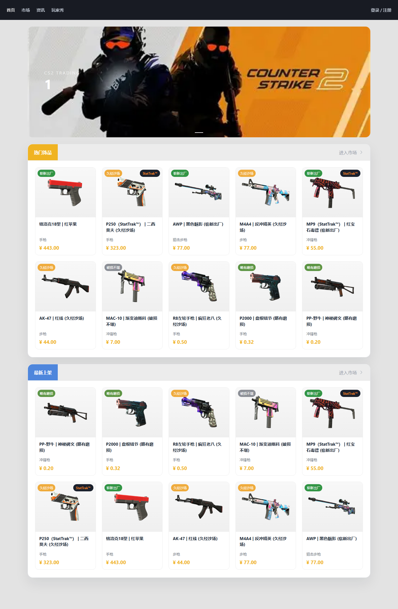
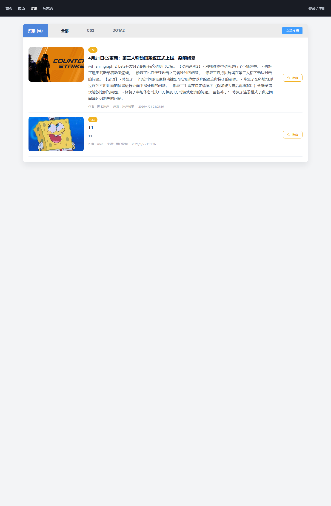
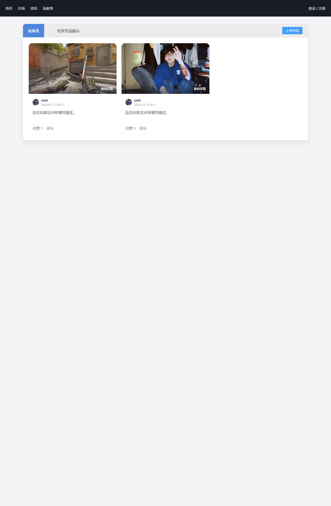

# 游戏道具管理系统（CS2Trade）

一个基于 Spring Boot 3 + Vue 3 的游戏道具交易与社区内容管理系统。项目当前以 CS2 饰品交易为主要场景，覆盖道具浏览、价格分析、买卖订单、库存同步、资讯投稿、玩家秀、消息通知、用户中心和后台管理等功能。

## 功能概览

- 道具市场：支持道具列表、分类筛选、详情展示、在售订单、求购订单和相似推荐。
- 交易流程：支持出售、求购、订单流转、钱包流水、交易记录和 WebSocket 消息通知。
- 价格分析：包含市场面板、成交记录、价格走势、库存分析和定价建议。
- Steam 集成：支持 Steam 库存同步、市场数据补全、图标修复、报价状态辅助检测。
- 社区内容：支持资讯列表、资讯详情、投稿管理、玩家秀发布、评论和点赞。
- 后台管理：覆盖用户、道具、订单、钱包、内容、消息、玩家秀和同步任务管理。

## 技术栈

| 模块 | 技术 |
| --- | --- |
| 前端 | Vue 3、Vue Router、Pinia、Element Plus、Axios、ECharts、Vite |
| 后端 | Spring Boot 3、Spring Security、MyBatis、MySQL、Redis、WebSocket |
| 数据与集成 | Steam Web API、JWT、Druid、PageHelper |
| 运行环境 | JDK 21、Maven 3.9+、Node.js 22+ |

## 目录结构

```text
.
├─ qd/                  前端项目（Vue 3 + Vite）
├─ hd/                  后端项目（Spring Boot + MyBatis）
├─ docs/screenshots/    README 页面截图
├─ scripts/             文档与辅助脚本
└─ 开发文档.md          毕业设计/项目设计文档
```

## 快速启动

### 1. 启动后端

先创建 MySQL 数据库并导入初始化脚本，主要脚本位于 `hd/src/main/resources/schema.sql` 和 `hd/src/main/resources/db/`。

```bash
cd hd
mvn spring-boot:run
```

默认后端地址：`http://localhost:8080/api`

### 2. 启动前端

```bash
cd qd
npm install
npm run dev
```

默认前端地址：`http://localhost:3000`

前端开发服务器已配置代理，`/api` 会转发到 `http://localhost:8080`。

## 配置说明

后端配置文件位于 `hd/src/main/resources/application.yml`。公开仓库中不要写入真实密钥，建议通过环境变量覆盖：

| 环境变量 | 说明 | 默认值 |
| --- | --- | --- |
| `DB_URL` | MySQL 连接地址 | `jdbc:mysql://localhost:3306/cs2trade...` |
| `DB_USERNAME` | MySQL 用户名 | `root` |
| `DB_PASSWORD` | MySQL 密码 | `123456` |
| `REDIS_HOST` | Redis 地址 | `localhost` |
| `REDIS_PORT` | Redis 端口 | `6379` |
| `JWT_SECRET` | JWT 签名密钥，至少 32 字节 | 开发默认值 |
| `STEAM_API_KEY` | Steam Web API Key | 空 |
| `STEAM_BOT_API_KEY` | Steam 交易监控机器人 API Key | 继承 `STEAM_API_KEY` |
| `STEAM_LOGIN_SECURE` | Steam 登录 Cookie，用于部分市场历史接口 | 空 |

PowerShell 示例：

```powershell
$env:DB_PASSWORD="your-db-password"
$env:JWT_SECRET="replace-with-at-least-32-bytes-secret"
$env:STEAM_API_KEY="your-steam-api-key"
cd hd
mvn spring-boot:run
```

## 常用命令

```bash
# 前端开发
cd qd
npm run dev

# 前端构建
cd qd
npm run build

# 后端测试
cd hd
mvn test

# 后端启动
cd hd
mvn spring-boot:run
```

## 页面预览

### 首页



### 饰品详情


### 资讯中心



### 玩家秀



## 项目文档

- [开发文档.md](开发文档.md)：包含项目背景、需求分析、系统架构、功能模块、数据库设计和接口规范。
- `hd/src/test/`：包含后端服务层与工具类测试。
- `docs/screenshots/`：包含项目展示截图，可用于答辩或作品展示。
